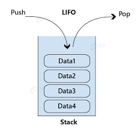

# About this repository

This repository was created to help understanding how data structures works using C language.

Below has an image to represent how queues, stacks works.

## Queues

## Stacks

## Additional

I created a program to calculate a rectangle area and a circle circumference,
to run it you need to insert -lm in the end of the gcc command to load the
math.h library
