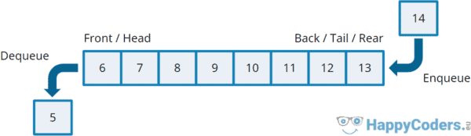

# About this repository

This repository was created to help understanding how data structures works using C language.

Below has an image to represent how queues, stacks works.

## Queues

## Stacks

